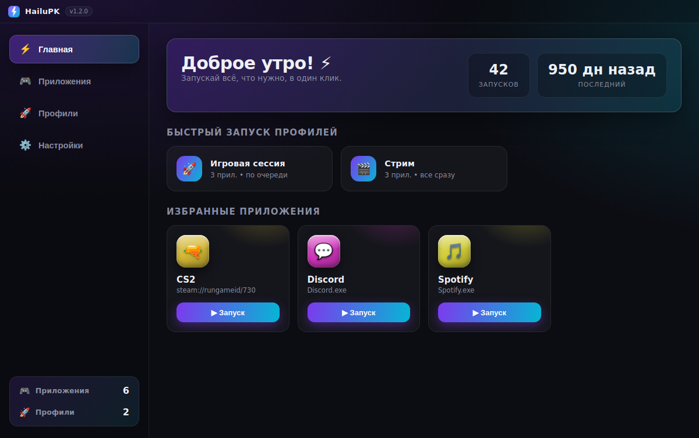
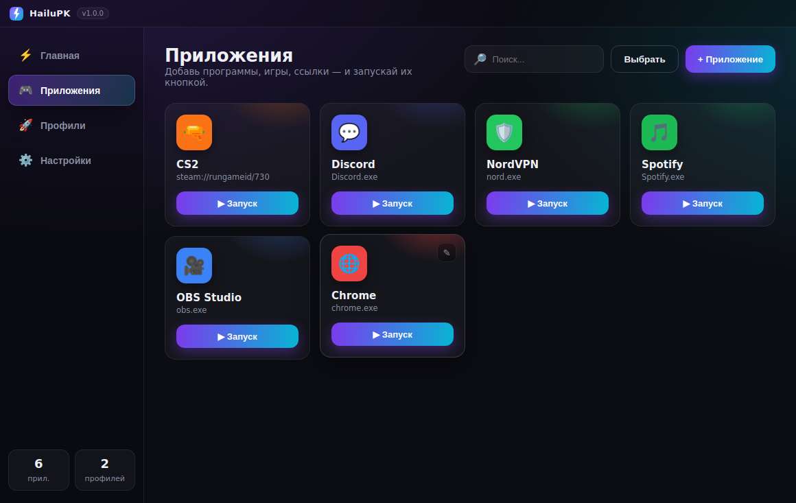
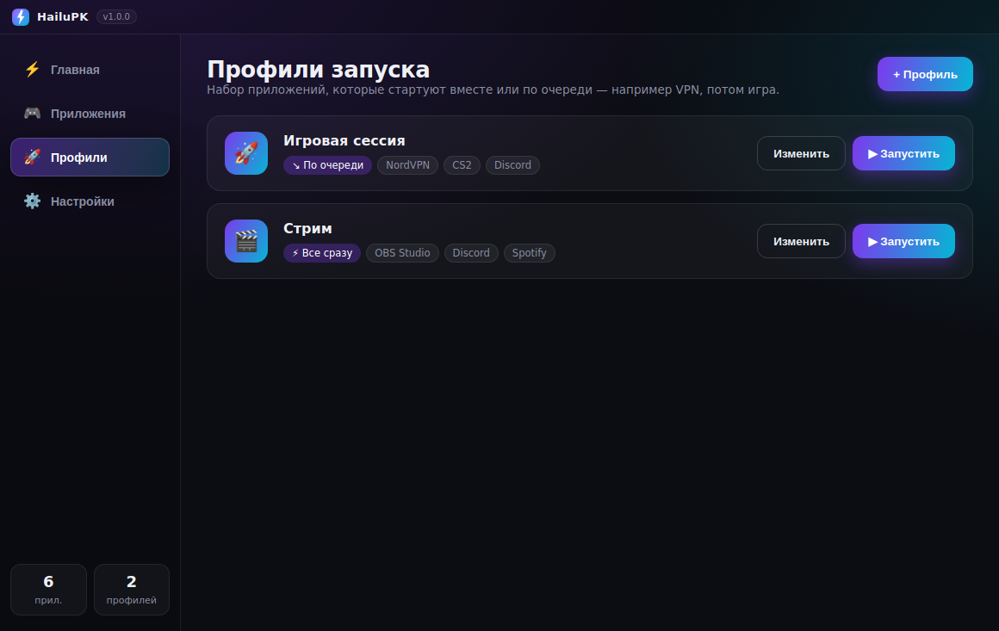
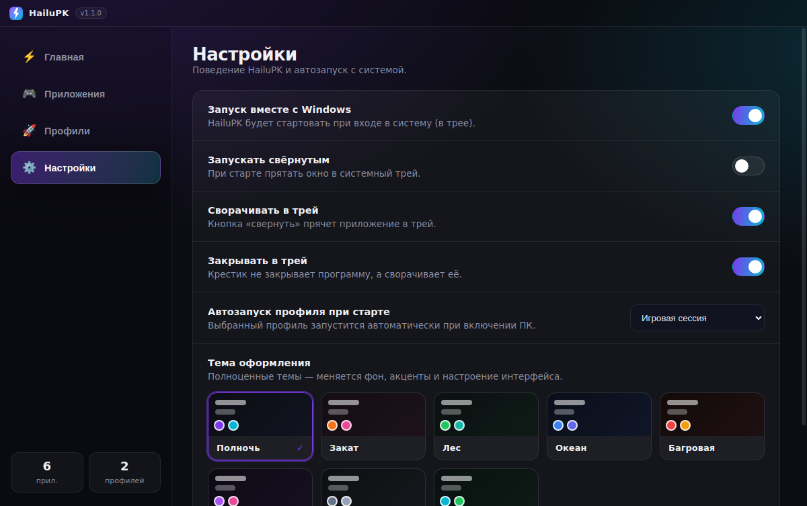
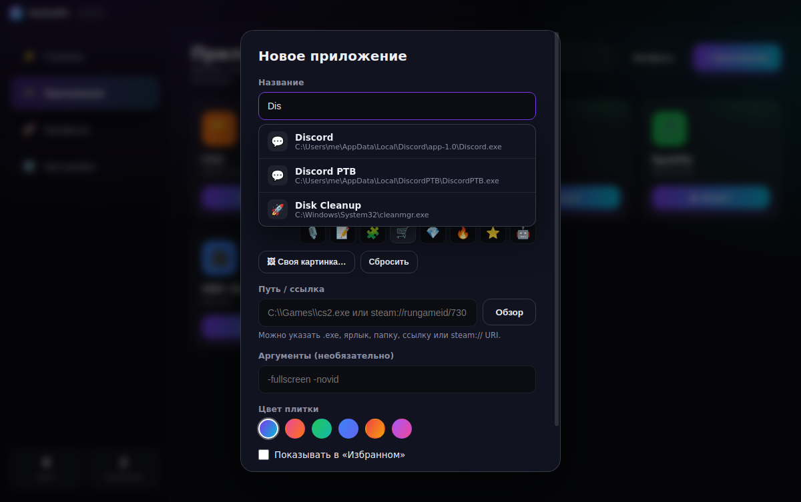

<div align="center">


# ⚡ HailuPK

**Красивый лаунчер приложений для Windows.**
Запускай игры и программы в один клик, собирай их в профили и стартуй вместе или по очереди — например сначала VPN, потом игра. Работает из системного трея и может запускаться вместе с Windows.

</div>



---

## ✨ Возможности

- 🔎 **Автоопределение приложений** — начни вводить название (например «Dis») и HailuPK сам найдёт установленную программу (Discord) и подставит путь. Сканирует ярлыки из меню «Пуск».
- 🎮 **Кнопки запуска** — добавь любую программу, игру, ярлык, папку или ссылку (`.exe`, `steam://`, `https://`…) и запускай её одной кнопкой.
- 🎨 **Полноценные темы оформления** — 8 тем (Полночь, Закат, Лес, Океан, Багровая, Неон, Графит, Аврора), меняющих фон и акценты целиком; набор готовых иконок + загрузка своей картинки.
- 🚀 **Профили запуска** — собери несколько приложений в профиль и запусти их:
  - **все сразу** (параллельно), или
  - **по очереди с задержками** — идеально, чтобы сначала поднять **VPN**, подождать пару секунд, а потом запустить **CS2** и **Discord**.
- ✅ **Мульти-выбор** — отметь несколько приложений галочками и запусти их пачкой.
- 🖥️ **Автозапуск с Windows** — HailuPK стартует вместе с системой и сворачивается в трей.
- ⏱️ **Авто-профиль при старте ПК** — например, при включении компьютера сам поднимает рабочий набор программ.
- 🎨 **Кастомизация** — иконки (эмодзи или своя картинка), цвета плиток, акцентная тема.
- 🔔 **Системный трей** — быстрый запуск профилей прямо из контекстного меню трея.
- 💾 **Всё локально** — настройки хранятся на твоём ПК, без облака и аккаунтов.

| Приложения | Профили | Настройки |
|---|---|---|
|  |  |  |

---

## ⬇️ Скачать (готовый `.exe`)

Готовые сборки публикуются на вкладке **[Releases](../../releases)**:

- `HailuPK-Setup-x.y.z.exe` — установщик (с ярлыками и автозапуском),
- `HailuPK-x.y.z-portable.exe` — портативная версия (без установки).

> Сборка под Windows автоматически создаётся через GitHub Actions
> (`.github/workflows/build.yml`). Чтобы получить `.exe`:
> 1. Открой вкладку **Actions** → workflow **«Build HailuPK (Windows)»** → **Run workflow**, либо
> 2. Создай тег версии — сборка соберётся и приложится к Release:
>    ```bash
>    git tag v1.0.0 && git push origin v1.0.0
>    ```

## 🛠️ Запуск из исходников

Нужен [Node.js](https://nodejs.org) 18+.

```bash
git clone <repo-url>
cd HELPWITHPK
npm install
npm start          # запустить приложение
```

### Собрать установщик локально (на Windows)

```bash
npm run dist            # NSIS-установщик + portable .exe в папке release/
npm run dist:portable   # только portable .exe
```

---

## 🚀 Как пользоваться

1. **Приложения → «+ Приложение»** — укажи название и путь (кнопка **«Обзор»** откроет проводник). Можно задать эмодзи/картинку и цвет.
2. **Профили → «+ Профиль»** — выбери режим (по очереди / все сразу), добавь шаги и для последовательного режима выставь задержку между ними в секундах.
3. **Настройки** — включи «Запуск вместе с Windows» и при желании выбери профиль для авто-старта при включении ПК.

### Пример: «VPN → игра»

1. Добавь приложения **NordVPN**, **CS2**, **Discord**.
2. Создай профиль *«Игровая сессия»*, режим **по очереди**:
   - Шаг 1: NordVPN — ждать **5 сек**
   - Шаг 2: CS2 — ждать **3 сек**
   - Шаг 3: Discord
3. Жми **▶ Запустить** (на дашборде, в списке профилей или из трея).



---

## 🧱 Технологии

- **Electron** — кроссплатформенный десктоп на web-стеке.
- Чистый HTML/CSS/JS без тяжёлых фреймворков, без внешних рантайм-зависимостей.
- Иконки генерируются скриптом `scripts/gen_icon.py` (чистый Python, без зависимостей).

## 📁 Структура

```
src/main/        — главный процесс Electron (окно, трей, автозапуск, запуск приложений)
src/renderer/    — интерфейс (HTML/CSS/JS)
scripts/gen_icon.py — генератор иконок (PNG + ICO)
build/           — иконки приложения
.github/workflows/build.yml — CI-сборка под Windows
```

## 📜 Лицензия

MIT.

<div align="center"><sub>Сделано с ⚡ — HailuPK</sub></div>
